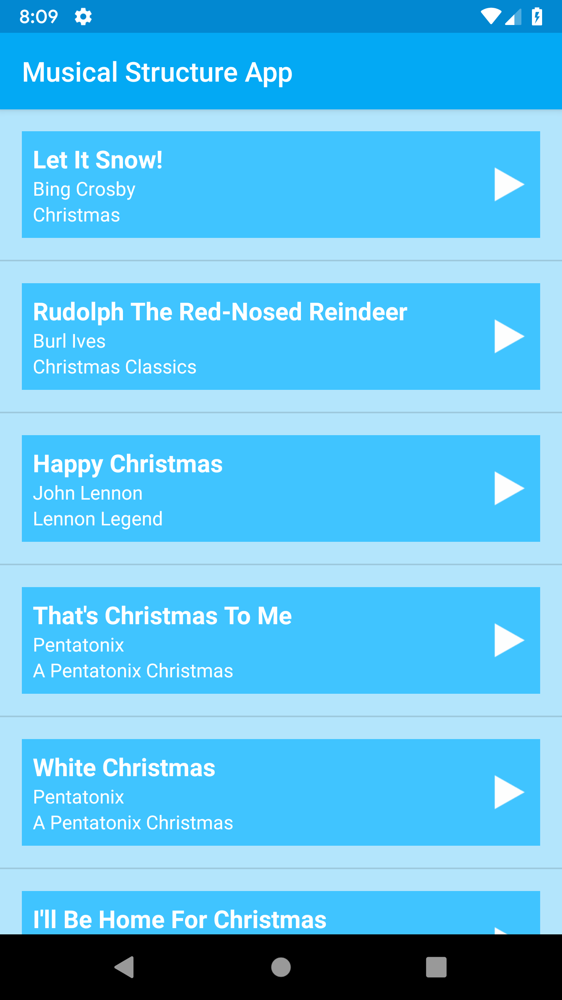
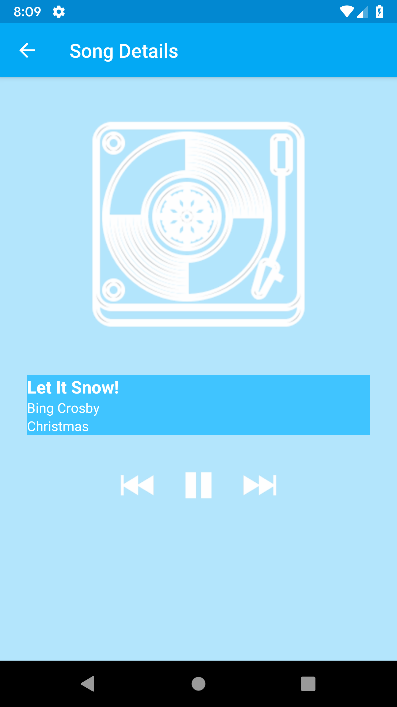

# Udacity Android Basics Nanodegree - MusicalStructureApp
This repository contains the MusicalStructureApp app from Udacity's Multi-Screen Apps course. This app is created using Android Studio and developed in Java. The layout was designed in an XML document using a combination of a ListView, RelativeLayouts, LinearLayouts, Textviews, and ImageViews. The activities in this app are linked via explicit intents. The app employs a custom song class to store information on the song. The app utilizes an ArrayAdapter as the data structure for storing instances of the custom class. The app also uses several OnClickListener objects to increase user interaction.

## Overview
MusicalStructureApp is an app that mimics the flow and structure of a music player app. When the user selects a song from the list, the app transitions to a view displaying the song's details. The user can return to the song list at any time and select another song. The app does not actually play music.

  
